# PureGamma AI
PureGamma AI is an AI-native investment research and decision-support platform for crypto and equity-aware portfolios. It combines market intelligence, portfolio NAV context, agent-based research, DeepSeek Harness deep research, a user-owned memory service, options surface analysis, strategy playbooks, simulated backtests, a trading-mandate foundation (PAPER/SHADOW live today), a gated **LIVE trading control plane** (spot-only, feature-flagged, default disabled), server-computed NAV, billing entitlements, an OpenAI-compatible API gateway, iOS/Android apps, and notification delivery into one research console.
The versioned declarative Skills Library is documented in
[`docs/SKILLS_LIBRARY.md`](docs/SKILLS_LIBRARY.md).
Implementation references: [public data sources](docs/PUBLIC_DATA_SOURCES.md), [Google auth](docs/GOOGLE_AUTH.md), [Agent chat](docs/AGENT_CHAT_ARCHITECTURE.md), [Harness research](docs/developer/HARNESS_RESEARCH_ARCHITECTURE.md), [Memory service](docs/developer/MEMORY_ARCHITECTURE.md), [Automated trading foundation](docs/developer/AUTOMATED_TRADING_FOUNDATION.md), [LIVE trading + NAV](docs/live-trading/ARCHITECTURE.md), [LIVE feature flags](docs/live-trading/FEATURE_FLAGS.md), [LIVE rollout status](docs/live-trading/STATUS.md), [Mobile API contract](docs/mobile/MOBILE_API_CONTRACT.md), [deployment checklist](docs/DEPLOYMENT_CHECKLIST.md), [implementation report](docs/IMPLEMENTATION_REPORT.md), and [AI API gateway](docs/AI_API_GATEWAY.md).
Start with the full documentation index: [docs/README.md](./docs/README.md).
## What is PureGamma AI?
PureGamma AI is an AI decision-support system for individual secondary-market investors. It helps users answer three daily questions:
- What changed in the market?
- How does it affect my portfolio and risk?
- Which research actions or playbooks are worth reviewing?
The product is built around a daily research workflow: shared market intelligence is generated once, user reports are personalized with preferences and portfolio context, and selected channels deliver the result through the web app, mobile apps, Telegram, iMessage, email, or Slack.
Current positioning focuses on three decision surfaces: understanding **Beta** exposure, discovering **evidence-backed Alpha**, and evaluating **Long Gamma** opportunities — all with explicit data sources and risk context.
## Core Features
Research and decision support:
- Daily market report, event reports, signals, and strategy playbooks.
- **Agent chat**: persistent conversations with SSE streaming, citations, tool calls, cancellation, plan quotas, and optional GPT-5.6 Luna model.
- **Private Secretary**: voice-based secretary interaction with iMessage verification (Max/Enterprise) and user-scoped memory policy.
- **Options research**: read-only Deribit BTC/ETH chains, Polygon.io equity chains, moneyness×DTE surfaces, and Long Gamma candidate scoring.
- **Backtest Lab**: unified backtest engine with quant metrics, artifacts, and candle data.
- **Research Runner**: user code executed in a no-network, read-only, resource-limited Docker sandbox with static AST validation.
- **DeepSeek Harness deep research** (Phase 1, `HARNESS_RESEARCH_ENABLED=false` by default): a research orchestration engine that plans multi-step investigations, coordinates macro / on-chain / options / risk sub-agents, snapshots cited evidence (`EvidenceSnapshot`), and returns server-validated `ResearchArtifact` results. Code executes only in a short-lived low-trust `harness-runner` container whose sole I/O is a capability-token-gated Research Gateway (no DB, Redis, Docker socket, or network by default); per-run credit budgets, daily caps, and global concurrency are enforced. Research only — it never creates orders.
- **Memory service** (Phase 1, `MEMORY_SERVICE_ENABLED=false` by default): PureGamma-owned user memory with explicit scope settings, consent-gated `MemoryProposal`s, append-only audit records, TTL'd conversation summaries, and ownership checks on every read/write. Memory is personalization context only — never trading authorization or risk input.
- **Skills library**: versioned declarative skills (schema 1.0) with layered tool whitelists and deterministic YAML DAG workflows.
Portfolio and trading:
- **Portfolio NAV**: consolidated NAV and history across Plaid Investments, Interactive Brokers (OAuth), and Hyperliquid (public), with encrypted token storage and freshness windows.
- **Server-side LIVE NAV** (`/api/portfolio/nav`): `NAV = cash + Σ(quantity × latest valid price)`, computed only on the server; snapshots older than 60s are marked `stale` and never fabricate a valuation (`nav=null`). Every snapshot records the price timestamp and calculation version; fills trigger a recalc and Celery recalculates every 30–60s.
- **Portfolio Autopilot**: scheduled review records with NAV, concentration, and freshness findings; Telegram/iMessage delivery.
- **Strategy library**: six built-in strategies (BTC momentum, ETH/BTC rotation, SOL high-beta, HYPE trend, MSTR BTC proxy, STRC event-driven credit).
- **Trading control plane**: accounts, positions, order preview/confirm/cancel, reconciliation, and kill-switch against an isolated Nautilus runtime (BACKTEST / PAPER / SHADOW only).
- **LIVE Trading Control Plane** (additive, every gate defaults OFF — see [STATUS](docs/live-trading/STATUS.md)): the only component that may submit LIVE spot orders. 23-step pipeline (ownership → mandate state → feature gate → user approval → broker health → whitelist → notional/balance/position/daily-loss/leverage/frequency → kill switch → idempotency → immutable `RiskCheck` → `OrderIntent` → mandate row lock → Execution Gateway → `broker_order_id` → fill sync → immutable `LedgerEntry` → NAV). Submit timeouts become `UNKNOWN` (queried, never blindly retried); every request carries a `trace_id`. All monetary math uses `Numeric(20,8)` (no floats).
- **Immutable ledger**: append-only (`INSERT` only; UPDATE/DELETE rejected by ORM events) supporting `cash_deposit/cash_withdrawal/trade_buy/trade_sell/fee/funding/dividend/adjustment/reconciliation_adjustment`. Reconciliation differences are posted as new `reconciliation_adjustment` entries — history is never rewritten.
- **Daily reconciliation**: exchange balance vs ledger vs NAV; on difference the user's mandate is paused, new orders are forbidden, data sync continues, ops are alerted, and manual review is required.
- **Kill switches** (4 scopes): global / user / mandate / broker-connection, plus auto-engagement from risk/reconciliation. When engaged: new orders refused; queries, cancels, fill recording, and reconciliation keep working; recovery always requires a human admin action.
- **Broker credentials**: stored only as Fernet ciphertext or a KMS reference on `broker_connections` — plaintext never touches the database; withdrawal/transfer/leverage/futures/options/shorting permissions are hard-denied.
- **Nautilus runtime**: isolated execution data plane with risk gateways (kill switch, nominal/leverage/daily-loss/frequency limits), execution journaling, restart recovery, and public market data adapters (Binance testnet, Hyperliquid, Coinbase Advanced). Live trading, withdrawals, and transfers remain disabled by policy.
- **Trading mandate foundation** (Phase 1): declarative `TradingMandate` records with dual confirmation, cooldown, and expiry; an immutable strategy-release reference; a four-layer gate (deterministic policy → PureGamma pre-trade risk → Nautilus independent risk) that permits PAPER/SHADOW actions today; auto-pause on stale data, risk breaches, or reconciliation needs; and append-only audits. LIVE execution has a code path only through the gated control plane above and stays disabled until every flag, approval, and health condition passes.
AI gateway and billing:
- **First-party OpenAI-compatible API Gateway** (`/v1/chat/completions`) with HMAC-hashed `sk-pg-…` keys, model catalog (Kimi K3, DeepSeek V4, GLM 5.2), admin-approved price revisions, per-key RPM limits, and fail-closed Redis.
- **Gateway prepaid wallet**: USD wallet independent of subscriptions/credits with Stripe Checkout top-ups, line-item ledger, idempotent crediting, and per-request locking (402 on insufficient balance).
- Stripe subscriptions with Checkout Sessions, Payment Links, credits, entitlements, and manual review; persisted credit reservation/settlement/refund state with an append-only ledger, automation budgets, and reward ledger.
Authentication and delivery:
- Google OIDC (PKCE/nonce), Sign in with Apple, email/password auth, and mobile OAuth sessions.
- Notifications: email, Telegram, Slack, APNs push, and a self-hosted iMessage relay (outbound and inbound).
- Daily brief with five delivery controls (market, portfolio, signals, risk, source sentiment).
Apps and admin:
- Next.js web app (en/zh), SwiftUI iOS app, and Android app (Compose + WebView) — mobile surfaces below — backed by the frozen [Mobile API contract](docs/mobile/MOBILE_API_CONTRACT.md).
- **iOS app (SwiftUI, `apps/ios/PureGamma`)**: Today, Agent, Research, Portfolio, and Account tabs. Account gains **Memory Controls** (scope toggles, consent, proposal approval/rejection, delete with double confirmation, export) and **Trading Safety** (mandate list/detail, risk limits, PAPER/SHADOW display, `LIVE_DISABLED` status, pause/resume gating). Research gains **Research Runs** (list/detail/evidence/timeline/launch form with unavailable + stale states). All new surfaces are gated by server `capabilities`; the client hard-forbids LIVE actions (`MandateActionPolicy.liveActionAllowed` is always false) and shows “feature unavailable” honestly when endpoints are missing (no fake data). `APIClient.streamGet` adds GET-SSE streaming; deep links route to research runs and push routes to `research_run`. Models use `LenientDecimal` and optional-field decoding so a missing capability can never crash the app.
- **Android app (Compose, `apps/android`)**: product content rendered in `ProductWebOverlay` with a `BuildConfig`-derived domain allowlist (`PG_PRODUCT_WEB_BASE_URL`); deep links `puregamma://research/runs/*` and FCM `research_run` routing via `AppViewModel`; `MobileRepository` treats 404/501 capabilities as fully unavailable (5xx surfaced, never faked); Account tab shows Memory/Trading/LIVE_DISABLED capability rows. Unit tests cover capability gating, LIVE interception, ID validation, and SSE compatibility (`SseClientCompatTest`, `MobileRepositoryTest`) — Gradle execution requires JDK 17 (not run on the authoring machine; verified by IDE static diagnostics, 0 errors).
- Mobile backend status: `/api/mobile/capabilities`, `/api/research/runs*`, and `/api/memory/*` are **not yet implemented** (mobile shows unavailable); `/api/trading/mandates*` plus `/api/trading/connections`, `/api/trading/orders/*`, and `/api/trading/safety-status` **are implemented** by the LIVE trading control plane push.
- Admin dashboard for users, reports, data sources, Stripe events, gateway pricing approvals, billing intents, and notifications; LIVE admin surfaces (user approvals, kill switches, broker connections, ledger, reconciliations) under `/admin/trading/*`.
## Architecture Overview

```mermaid
flowchart TD
  User["User"] --> Web["Next.js web app"]
  User --> iOS["iOS app (SwiftUI)"]
  User --> Android["Android app (Compose + WebView)"]
  Web --> API["FastAPI API"]
  iOS --> API
  Android --> API
  API --> Auth["Google / Apple / Email / JWT"]
  API --> Billing["Stripe, credits, entitlements, wallet"]
  API --> Agent["Agent engine + Secretary"]
  API --> Gateway["OpenAI-compatible API gateway"]
  Gateway --> LLM["DeepSeek / Kimi / GLM / Luna"]
  API --> Options["Options research (Deribit / Polygon)"]
  API --> Backtest["Backtest Lab + unified engine"]
  API --> ResearchRunner["Research sandbox (Docker)"]
  API --> Harness["DeepSeek Harness: orchestrator + low-trust runner"]
  Harness --> DB
  API --> Memory["Memory service (scoped, audited)"]
  Memory --> DB
  API --> Skills["Skills library + workflows"]
  API --> Portfolio["Plaid / IBKR / Hyperliquid NAV"]
  API --> Trading["Trading control plane"]
  Trading -->|HMAC-signed| Runtime["Nautilus runtime: PAPER / SHADOW / BACKTEST"]
  API --> LiveCP["LIVE Trading Control Plane (gated)"]
  LiveCP --> RiskEngine["Risk engine (Decimal, versioned)"]
  LiveCP --> ExecGW["Execution Gateway adapter (nautilus / mock)"]
  ExecGW --> Runtime
  LiveCP --> Ledger["Immutable ledger"]
  LiveCP --> NAV["Server-side NAV calculator"]
  LiveCP --> Recon["Daily reconciliation + kill switches"]
  API --> Notify["Notification dispatcher"]
  Notify --> Email["Email"]
  Notify --> Telegram["Telegram"]
  Notify --> Slack["Slack"]
  Notify --> APNs["APNs push"]
  Notify --> Relay["Self-hosted iMessage relay"]
  API --> Data["Market / sentiment / document providers"]
  API --> DB["Postgres or local SQLite"]
  API --> Redis["Redis and Celery workers"]
```

Backend layers:
| Layer | Location | Responsibility |
| --- | --- | --- |
| Routers | `apps/api/routers` | HTTP endpoints (auth, agent, gateway, options, trading, skills, backtest, portfolio, billing, admin, …) |
| Services | `apps/api/services` | Business logic |
| Database | `packages/database` | SQLAlchemy models, Alembic migrations, seed data |
| Agents | `packages/agents` | Research, market, risk, strategy, report composition |
| Gateway | `packages/gateway` | Model catalog, pricing, security, usage metering |
| Skills | `packages/skills` | Skill registry, permissions, deterministic workflows |
| Billing | `packages/billing` | Plans, credit costs, entitlements, metering |
| Trading | `packages/trading` | Order intents, state machines, safety policies, runtime client |
| Live trading | `packages/live_trading` | Feature gates, secret store, risk engine, control plane, immutable ledger, NAV, kill switches, reconciliation, gateway adapter |
| Nautilus | `packages/nautilus`, `services/nautilus-runtime` | Data adapter, guardrails, isolated runtime |
| Options | `packages/options` | Chain, surface, Long Gamma scoring |
| Research Runner | `packages/research_runner` | Sandboxed user-code execution |
| Harness | `packages/harness` | Deep-research orchestration, security gates, state machine, mock adapter |
| Memory | `packages/memory` | User memory policy, scope settings, proposals, audits |
| Data | `packages/data` | Market, on-chain, RSS, FinTwit, macro providers |
| Notifications | `packages/notifications` | Channel providers and dispatcher |
| Workers | `packages/workers` | Celery tasks and schedules |
Key design principles:
- **Control plane / data plane separation**: the FastAPI control plane never connects to exchanges directly; it talks to the isolated Nautilus runtime over HMAC-signed internal commands.
- **Deterministic core, LLM explanation**: `API -> policy/entitlement -> metering quote/reservation -> deterministic service -> evidence/artifact -> LLM explanation`; no model bypasses policy or billing.
- **Sandboxed user code**: user research scripts run only inside the no-network Docker sandbox; the API process never executes user code.
- **Two-layer research trust split**: the trusted `harness-orchestrator` plans, budgets, and validates research; the untrusted `harness-runner` executes in a short-lived container whose only I/O is the capability-token-gated Research Gateway.
- **Fail-closed defaults**: mock providers are development-only; missing credentials report `NOT_CONFIGURED`; live trading, withdrawal, and transfer are disabled by policy.
Current implementation status:
- Implemented: FastAPI + Next.js, Agent chat + Secretary, options research, Backtest Lab, Skills, gateway (phase 1) + prepaid wallet, Stripe billing with credit state machine, NAV connectors (Plaid/IBKR/Hyperliquid) + Autopilot, trading control plane with PAPER/SHADOW runtime, notifications, iMessage relay + verification, Google/Apple/Email auth, admin consoles, iOS/Android apps (code complete, not yet in App Store/Play), DeepSeek Harness foundation + Memory service + trading mandate foundation (Phase 1, all flags OFF), mobile Memory Controls / Trading Safety / Research Runs surfaces (frozen v1 API contract), and the **LIVE Trading Control Plane + NAV** (migration 0026, every gate default OFF — see [STATUS](docs/live-trading/STATUS.md)).
- Partially implemented or placeholder: real-time market stream parity, some P2+ internal surfaces (Risk/Realtime/MCP contracts return `NOT_IMPLEMENTED`), Redis Streams event pipeline, Bloomberg enterprise import, mobile backend endpoints `/api/mobile/capabilities`, `/api/research/runs*`, `/api/memory/*` (mobile renders honest “unavailable” states).
- Planned or documented contract: production launch gating, App Store/Play release, real broker adapter provisioning for LIVE (currently `LIVE_TRADING_GATEWAY=mock`), first-user LIVE approvals.
More detail: [Architecture](./docs/developer/ARCHITECTURE.md), [Target Architecture](./docs/review/TARGET_ARCHITECTURE.md), [V5 Initial Launch Review](./docs/V5_INITIAL_LAUNCH_REVIEW.md).
## Repository Layout
```
apps/
  api/                 FastAPI backend (routers, services)
  web/                 Next.js web app (en/zh)
  ios/                 SwiftUI iOS app
  android/             Kotlin/Compose Android app
  imessage-relay/      Self-hosted macOS iMessage relay
  site/                Vinext/Cloudflare Sites experiment
packages/
  agents/              LLM agents, prompts, routing
  backtest/            Backtest engines and metrics
  billing/             Plans, credits, metering, entitlements
  capabilities/        Capability status registry
  config/              SecretStore, settings
  data/                Market/data provider adapters
  database/            Models + Alembic migrations (0001–0026)
  gateway/             AI gateway catalog, pricing, security, usage
  harness/             Deep-research orchestration + security gates
  live_trading/        LIVE control plane: gates, risk, ledger, NAV, kill switches, reconciliation
  memory/              User memory policy + service
  nautilus/            Nautilus data adapter + guardrails
  notifications/       Dispatcher and channel providers
  options/             Options research domain
  research_runner/     Sandboxed research execution
  reports/             Report composition
  risk/                Deterministic risk engine
  security/            Password hashing and security helpers
  skills/              Skills library + workflows
  strategies/          Built-in strategy library
  trading/             Trading domain, state machines, policies
  workers/             Celery tasks and scheduler
services/
  nautilus-runtime/    Isolated execution data plane
config/                gateway catalog, LLM costs, strategy specs, sources
deploy/                Production compose, systemd units, scripts
scripts/               Ops, migration, and verification scripts
docs/                  Documentation (product, developer, ops, security, live-trading, mobile)
tests/                 pytest unit/integration + Playwright e2e
```
## Quickstart
```bash
cp .env.example .env
docker compose up -d postgres redis nautilus-runtime
python3 -m pip install -r apps/api/requirements.txt
uvicorn apps.api.main:app --reload --host 127.0.0.1 --port 8000
```
In a second shell:
```bash
cd apps/web
pnpm install
NEXT_PUBLIC_API_URL=http://localhost:8000 pnpm dev
```
Open `http://localhost:3000/en/dashboard` or `http://localhost:3000/zh/dashboard`.
Full guide: [Quickstart](./docs/getting-started/QUICKSTART.md).
## Environment Variables
Copy the template and never commit real secrets:
```bash
cp .env.example .env
```
Important groups:
- Core/Auth: `APP_ENV`, `LOG_LEVEL`, `JWT_SECRET`, `AUTH_ALLOW_DEMO_FALLBACK`, `NEXT_PUBLIC_API_URL`, Google OAuth, Apple Sign-in, email auth settings
- Database and Redis: `DATABASE_URL`, `REDIS_URL`, `WORKER_CONCURRENCY`
- LLM: `LLM_PROVIDER`, DeepSeek variables, `OPENAI_LUNA_ENABLED` (optional GPT-5.6 Luna)
- Gateway: `GATEWAY_ENABLED`, `GATEWAY_API_KEY_PEPPER`, `GATEWAY_ENABLED_PROVIDERS`, provider keys and regional pricing catalogs
- Billing: `BILLING_MODE`, `BILLING_CHECKOUT_MODE`, `STRIPE_SECRET_KEY`, `STRIPE_WEBHOOK_SECRET`, recurring Price IDs, Payment Link URLs
- Portfolio connectors: `PORTFOLIO_TOKEN_ENCRYPTION_KEY` (Fernet), Plaid, IBKR OAuth, Hyperliquid
- Push: APNs `.p8` key settings, push device registration
- Notifications: `TELEGRAM_BOT_TOKEN`, `SLACK_WEBHOOK_URL`, SMTP settings, iMessage relay settings and verification limits
- Data providers: CoinDesk RSS, FinTwit, X, CoinGecko, CryptoPanic, Glassnode, Coinglass, DefiLlama, FRED, EVM RPC endpoints, Bloomberg import
- Safety: `NAUTILUS_LIVE_TRADING_ENABLED=false`, `NAUTILUS_ALLOW_LIVE_ORDER=false`, `NAUTILUS_ALLOW_WITHDRAWAL=false`, `NAUTILUS_ALLOW_TRANSFER=false`
- Harness / Memory / Auto-trading (Phase 1, additive, all default OFF): `HARNESS_RESEARCH_*`, `MEMORY_*`, `AUTO_TRADING_*` — see [Harness architecture](./docs/developer/HARNESS_RESEARCH_ARCHITECTURE.md) and [Harness runbook](./docs/operations/HARNESS_RUNBOOK.md)
- LIVE Trading Control Plane (additive, every gate default OFF): `LIVE_TRADING_ENABLED`, `LIVE_TRADING_DEPLOYMENT_APPROVED`, `LIVE_TRADING_PROVIDER`, `LIVE_TRADING_GATEWAY`, `LIVE_TRADING_ALLOWED_SYMBOLS`, `LIVE_CREDENTIAL_ENCRYPTION_KEY`, `LIVE_NAV_PRICE_STALE_SECONDS`, sync-interval budget vars — see [LIVE feature flags](./docs/live-trading/FEATURE_FLAGS.md)
Reference: [Environment Variables](./docs/getting-started/ENVIRONMENT_VARIABLES.md).
## Mock Mode
Mock mode is the default local development path:
- `BILLING_MODE=mock` returns local checkout and portal URLs.
- `POST /auth/mock-login` creates a local HMAC-signed bearer token.
- Market data uses `MockMarketDataProvider`.
- Notification providers return mock success when credentials are missing.
- iMessage uses `IMESSAGE_PROVIDER=mock` unless the relay is enabled.
- Mock providers are never treated as healthy capabilities in production mode.
Reference: [Mock Mode](./docs/getting-started/MOCK_MODE.md).
## Docker Compose
```bash
cp .env.example .env
docker compose up --build
```
Services:
- API: `http://localhost:8000`
- Postgres: `localhost:5432`
- Redis: `localhost:6379`
- iMessage relay: `http://localhost:8787`
- Nautilus runtime: `http://localhost:8090` (private service in production)
Production deployment uses `docker compose -f docker-compose.production.yml up -d --build` with non-root images, a Next.js standalone web image, Caddy TLS, systemd units, and validation via `scripts/production-smoke.sh`. See [Deployment Overview](./docs/deployment/DEPLOYMENT_OVERVIEW.md) and [Production Checklist](./docs/deployment/PRODUCTION_CHECKLIST.md).
## AI API Gateway
PureGamma exposes a first-party OpenAI-compatible API for paid users:
```python
from openai import OpenAI
client = OpenAI(api_key="sk-pg-…", base_url="https://api.puregamma.ai/v1")
response = client.chat.completions.create(
    model="deepseek-v4-pro",
    messages=[{"role": "user", "content": "Hello"}],
)
```
- Create a `sk-pg-…` key at `/gateway` (shown once; raw key material is never stored).
- Phase-1 model IDs: `kimi-k3-max`, `deepseek-v4-pro`, `deepseek-v4-flash`, `glm-5.2`.
- `POST /v1/chat/completions` supports streaming, JSON mode, and tools; `GET /v1/models` lists only approved models.
- Activation requires the database migration, `GATEWAY_ENABLED=true`, an allow-listed provider set, admin bootstrap/sync, and price-revision approval.
- Usage can be prepaid through the gateway wallet (Stripe top-up) or metered against the subscription.
Details: [AI API Gateway](./docs/AI_API_GATEWAY.md).
## Stripe Setup
PureGamma uses Stripe Billing with recurring Prices, Checkout Sessions, Payment Links, Customer Portal, webhooks, manual review, and credit grants.
```bash
BILLING_MODE=stripe
BILLING_CHECKOUT_MODE=session
STRIPE_SECRET_KEY=sk_test_...
STRIPE_WEBHOOK_SECRET=whsec_...
STRIPE_PRICE_PRO=price_...
STRIPE_PRICE_MAX=price_...
STRIPE_PRICE_ENTERPRISE=price_...
STRIPE_PAYMENT_LINK_PRO=https://buy.stripe.com/...
STRIPE_PAYMENT_LINK_MAX=https://buy.stripe.com/...
```
Local webhook test:
```bash
stripe listen --forward-to localhost:8000/stripe/webhook
stripe trigger checkout.session.completed
stripe trigger invoice.paid
```
Duplicate webhook events are idempotent by `stripe_event_id`. Unknown Payment Link plan mapping enters `/admin/billing-intents` manual review. Credit operations use a persisted reservation → settlement/refund state machine with an append-only ledger. Details: [Stripe](./docs/integrations/STRIPE.md), [Credit and Entitlements](./docs/developer/CREDIT_AND_ENTITLEMENTS.md).
## Auth Setup
Supported sign-in flows:
- **Google OAuth** (web + mobile PKCE): `GOOGLE_CLIENT_ID`, `GOOGLE_CLIENT_SECRET`, `GOOGLE_OAUTH_REDIRECT_URI=http://localhost:8000/auth/google/callback`.
- **Sign in with Apple** (mobile): server-side code exchange with hashed nonce.
- **Email/password**: hashed credentials via `packages/security`.
- **Mock login** remains available for local development and is rejected in production.
## LLM Setup
DeepSeek is available through the shared OpenAI-compatible LLM provider abstraction.
```bash
LLM_PROVIDER=deepseek
DEEPSEEK_API_KEY=
DEEPSEEK_BASE_URL=https://api.deepseek.com
DEEPSEEK_MODEL=deepseek-v4-flash
```
Keep real API keys only in local `.env` or a secret manager. Missing keys fall back to mock mode locally and report `NOT_CONFIGURED` in production. Details: [DeepSeek](./docs/integrations/DEEPSEEK.md).
## iMessage Relay Setup
iMessage has no general server API. PureGamma uses a self-hosted Mac relay for users or deployments that opt in.
```bash
cd apps/imessage-relay
python3 -m pip install -r requirements.txt
export IMESSAGE_RELAY_SECRET=change-me
uvicorn relay:app --host 127.0.0.1 --port 8787
```
API-to-relay calls are signed with HMAC-SHA256 over `{timestamp}.{raw_body}` and use idempotency keys. The relay supports outbound delivery and inbound events, and does not read the private Messages database. iMessage verification (Max/Enterprise) uses E.164 normalization with per-user/per-recipient rate limits.
Details: [iMessage Relay](./docs/integrations/IMESSAGE_RELAY.md), [iMessage Security](./docs/security/IMESSAGE_SECURITY.md).
## Portfolio NAV and Connectors
Portfolio NAV is the estimated value of synced brokerage, exchange, and on-chain positions using current or most recent available prices. It is not a broker statement, custodian statement, tax statement, or audit record.
- Plaid Investments (holdings, securities, transactions) — sandbox-ready.
- Interactive Brokers via OAuth (all returned accounts aggregated).
- Hyperliquid public accounts (perpetual + spot).
- Multi-account NAV history, capped/downsampled charts, explicit freshness windows (Plaid 36h; IBKR/Hyperliquid 15min), encrypted refresh-token storage (`PORTFOLIO_TOKEN_ENCRYPTION_KEY` Fernet key).
- Portfolio Autopilot creates persisted review records and delivers findings via Telegram/iMessage.
Details: [Plaid](./docs/integrations/PLAID.md), [Exchange Read-only Keys](./docs/integrations/EXCHANGE_READONLY_KEYS.md), [On-chain Wallets](./docs/integrations/ONCHAIN_WALLETS.md), [Portfolio NAV](./docs/product/PORTFOLIO_NAV.md), [Portfolio Autopilot Review](./docs/PORTFOLIO_AUTOPILOT_PRODUCTION_REVIEW.md).
## NautilusTrader Runtime
PureGamma uses an isolated Nautilus-compatible runtime for research, backtesting, and PAPER/SHADOW strategy execution. Live trading remains disabled.
- Execution modes: BACKTEST, PAPER, SHADOW, Mock. Native Nautilus is used where a supported wheel is available; otherwise the runtime reports Mock Bridge explicitly.
- Risk gateway: kill switch, pause-new-orders, nominal/leverage/daily-loss/frequency limits.
- Execution gateway: idempotent journal-based order handling; reconciliation failures pause opening.
- Persistent paper positions, restart recovery of uncertain orders, and idempotent main-database projection.
- Public market data adapters: Binance spot testnet, Hyperliquid, Coinbase Advanced (read-only).
- The control plane reaches the runtime only through HMAC-signed internal commands.
- The LIVE control plane talks to the runtime through an **Execution Gateway adapter layer** (`packages/live_trading/gateway_adapter.py`): a Nautilus adapter (submit/query/cancel/balances/positions with UNKNOWN-on-timeout semantics) and an honest mock that never fakes fills while `LIVE_TRADING_GATEWAY=mock`.
Details: [NautilusTrader](./docs/integrations/NAUTILUS_TRADER.md), [Phase 2 public market runtime](./docs/trading/PHASE_2_PUBLIC_MARKET_RUNTIME.md), [Phase 3 persistent paper portfolio sync](./docs/trading/PHASE_3_PAPER_PORTFOLIO_SYNC.md), [Trading Safety](./docs/trading/TRADING_SAFETY.md), [LIVE architecture](./docs/live-trading/ARCHITECTURE.md).
## Data Pipeline
Data adapters live in `packages/data`. Mock data is active by default in development. The primary document pipeline is RSS, curated FinTwit, the official X API, and authorized Bloomberg data; normalized records carry provenance, license status, retention policy, entity mentions, sentiment components, event fingerprints, and provider sync logs. Optional extension providers: Binance, DefiLlama, EVM RPC, and an allow-listed Subgraph registry (disabled by default).
Pipeline docs:
- [Adding a Data Provider](./docs/developer/ADDING_DATA_PROVIDER.md)
- [Data Sources](./docs/DATA_SOURCES.md)
- [Data License](./docs/DATA_LICENSE.md)
- [Agent Evidence Pipeline](./docs/AGENT_DATA_PIPELINE.md)
- [CoinDesk RSS](./docs/integrations/COINDESK_RSS.md)
- [X KOL](./docs/integrations/X_KOL.md)
- [Bloomberg](./docs/integrations/BLOOMBERG.md)
## Credits and Plans
Plans are defined in `packages/billing/plans.py`. Entitlement responses distinguish `subscribed_plan` from `effective_plan`: active and trialing subscriptions receive their purchased capabilities; past-due subscriptions run on the Free baseline with read-only portfolio access; unpaid or canceled subscriptions use the complete Free baseline without deleting historical data.
| Plan | Monthly credits | Channels | High-cost tasks |
| --- | ---: | --- | --- |
| Free | 30 | Email | No |
| Pro | 1000 | Telegram, Email | Yes |
| Max | 10000 | Telegram, Slack, Email, iMessage | Yes |
| Enterprise | 50000 default/custom | Telegram, Slack, Email, iMessage | Yes |
Key credit costs:
- Daily market report: 10
- Event report: 5
- Sentiment scan: 8
- X sentiment scan: 20
- On-chain scan: 12
- Backtest: 25
- Playbook generation: 30
- iMessage alert: 3
Portfolio account limits: Free and restricted users cannot add accounts, Pro can add one, and Max can add five. Gateway access requires an active paid Stripe-backed plan; gateway wallet balance is settled independently.
Reference: [Credit and Entitlements](./docs/developer/CREDIT_AND_ENTITLEMENTS.md).
## Security Notes
- Use strong `JWT_SECRET` values outside local development; keep `AUTH_ALLOW_DEMO_FALLBACK=false` outside isolated demos.
- Store Stripe, Plaid, exchange, SMTP, relay, and provider secrets only in a secret manager or environment store.
- Use read-only exchange keys only; never enable withdrawals, trading, margin transfer, or custody permissions.
- Encrypt portfolio access tokens and exchange API key material (`PORTFOLIO_TOKEN_ENCRYPTION_KEY` Fernet) before persistence.
- Gateway API keys are HMAC-hashed with a separate `GATEWAY_API_KEY_PEPPER`; raw key material is never stored or logged; prompts and provider response bodies are not retained.
- Restrict `/admin/*` endpoints to users with `role=admin`.
- The iMessage relay must be network-restricted and signed with `IMESSAGE_RELAY_SECRET`.
- Mock providers are not healthy production capabilities; production fails closed with `NOT_CONFIGURED`.
- Live trading, withdrawals, and transfers are disabled by policy and cannot be enabled by configuration alone.
Reference: [Security Overview](./docs/security/SECURITY_OVERVIEW.md), [Secret Handling](./docs/security/SECRET_HANDLING.md).
## Compliance Disclaimer
PureGamma produces research, summaries, simulated backtests, risk views, and notifications. It does not provide personalized investment advice, tax advice, legal advice, custody, brokerage, or trade execution. Backtests are hypothetical and do not predict future results. Portfolio NAV is an estimate and not an official statement.
Reference: [Disclaimer Guide](./docs/compliance/DISCLAIMER_GUIDE.md), [Backtest Disclosure](./docs/compliance/BACKTEST_DISCLOSURE.md), [Portfolio NAV Disclosure](./docs/compliance/PORTFOLIO_NAV_DISCLOSURE.md).
## Testing
```bash
python3 -m pytest
```
Backend uses pytest (unit, integration, gateway, security, quant, workers); frontend uses Playwright e2e:
```bash
cd apps/web && pnpm typecheck && pnpm lint && pnpm test:e2e
```
Useful manual checks:
```bash
curl http://localhost:8000/health
curl -X POST http://localhost:8000/auth/mock-login \
  -H "Content-Type: application/json" \
  -d '{"email":"demo@puregamma.ai","name":"Demo User"}'
```
## Roadmap
- Launch gating: hide internal research, mock, admin, and runtime surfaces from customer routes; finish `unavailable/stale/partial` visual states.
- Production launch configuration: real credentials, DNS/TLS, backups, target-host smoke, App Store/Play release for iOS and Android.
- LIVE rollout (only after every gate passes — see `docs/live-trading/`): provision a real broker adapter (`LIVE_TRADING_GATEWAY=nautilus`), approve a small pilot cohort (`/admin/trading/live-approvals`), approve production-environment mandates, then flip the deployment marker and `LIVE_TRADING_ENABLED` last.
- Implement remaining mobile backend endpoints (`/api/mobile/capabilities`, `/api/research/runs*`, `/api/memory/*`) to activate the prepared mobile surfaces.
- Complete the Redis Streams event pipeline with DLQ.
- Extend gateway catalog (CNY→USD pricing policy for GLM) and wallet settlement reconciliation in staging.
- Replace mock market providers with production data routers and source health SLAs where real licenses allow.
- Add enterprise tenant isolation, audit export, data deletion workflow, and private deployment controls.
