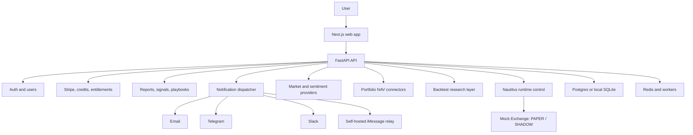

# PureGamma AI

Implementation references: [public data sources](docs/PUBLIC_DATA_SOURCES.md), [Google auth](docs/GOOGLE_AUTH.md), [Agent chat](docs/AGENT_CHAT_ARCHITECTURE.md), [deployment checklist](docs/DEPLOYMENT_CHECKLIST.md), and [implementation report](docs/IMPLEMENTATION_REPORT.md).

PureGamma AI is an AI-native crypto and equity investment research SaaS. It combines market data, sentiment, portfolio context, strategy playbooks, simulated backtests, billing entitlements, credit controls, and notification delivery into one research console.

PureGamma AI is research software only. It does not place trades, custody funds, automate execution, give tax advice, or promise investment returns. Every report, signal, playbook, backtest, portfolio view, and push notification must include or preserve the disclaimer: `Users bear all risks of using this service. The service provider is not responsible for any AI-generated content.`

Start with the full documentation index: [docs/README.md](./docs/README.md).

## What is PureGamma AI?

PureGamma AI helps active crypto and equity investors answer three daily questions:

- What changed in the market?
- How does it affect my portfolio and risk?
- Which research actions or playbooks are worth reviewing?

The product is built around a daily research workflow: shared market intelligence is generated once, user reports are personalized with preferences and portfolio context, and selected channels deliver the result through the web app, email, Telegram, Slack, or a self-hosted iMessage relay.

## Core Features

- Daily crypto market report.
- Portfolio NAV brief and portfolio-aware research experience.
- iMessage daily push through a self-hosted Mac relay.
- Stripe subscriptions with Checkout Sessions, Payment Links, credits, entitlements, and manual review.
- OpenAI-compatible LLM provider abstraction with DeepSeek and mock fallback.
- Google OAuth login with mock login retained for local development.
- Plaid investments data design for brokerage holdings, securities, and investment transactions.
- Exchange read-only balance and trade sync design for Binance, OKX, Bybit, and Hyperliquid.
- On-chain wallet sync design for public wallet holdings.
- CoinDesk/RSS, X KOL, Bloomberg, market, on-chain, and macro data pipeline docs.
- Strategy drafts, versioned activation intents, mock/native backtests, and PAPER/SHADOW runtime control.
- Admin dashboard for users, reports, data sources, Stripe events, notifications, and subscriptions.
- Mock mode for local product demos without third-party credentials.

## Architecture Overview



Current implementation status:

- Implemented: FastAPI, Next.js app, auth mock login, reports, signals, playbooks, Stripe Billing, Payment Links, credits, DeepSeek/mock LLM provider, notifications, iMessage relay, worker tasks, mock market data, mock/native backtest selection, strategy control, and PAPER/SHADOW Nautilus runtime.
- Partially implemented or placeholder: real market provider adapters and external exchange adapter execution.
- Planned or documented contract: Plaid account sync, exchange read-only account sync, on-chain wallet sync, full Portfolio NAV backend, Bloomberg enterprise import.

More detail: [Architecture](./docs/developer/ARCHITECTURE.md).

## Quickstart

```bash
cp .env.example .env
docker compose up -d postgres redis
python3 -m pip install -r apps/api/requirements.txt
uvicorn apps.api.main:app --reload --host 127.0.0.1 --port 8000
```

In a second shell:

```bash
cd apps/web
pnpm install
NEXT_PUBLIC_API_URL=http://localhost:8000 pnpm dev
```

Open `http://localhost:3000/en/dashboard` or `http://localhost:3000/zh/dashboard`.

Full 15 minute guide: [Quickstart](./docs/getting-started/QUICKSTART.md).

## Environment Variables

Copy the template and never commit real secrets:

```bash
cp .env.example .env
```

Important groups:

- Core/Auth: `APP_ENV`, `LOG_LEVEL`, `JWT_SECRET`, `AUTH_ALLOW_DEMO_FALLBACK`, `NEXT_PUBLIC_API_URL`, `GOOGLE_CLIENT_ID`, `GOOGLE_CLIENT_SECRET`, `GOOGLE_OAUTH_REDIRECT_URI`
- Database and Redis: `DATABASE_URL`, `REDIS_URL`, `WORKER_CONCURRENCY`
- LLM: `LLM_PROVIDER`, OpenAI-compatible variables, DeepSeek variables
- Billing: `BILLING_MODE`, `BILLING_CHECKOUT_MODE`, `STRIPE_SECRET_KEY`, `STRIPE_WEBHOOK_SECRET`, recurring Price IDs, Payment Link URLs
- Notifications: `TELEGRAM_BOT_TOKEN`, `SLACK_WEBHOOK_URL`, SMTP settings, iMessage relay settings
- Portfolio connectors: Plaid, exchange read-only keys, on-chain RPC settings
- Data providers: CoinDesk RSS, CoinGecko, X, CryptoPanic, Glassnode, Coinglass, FRED, Bloomberg import
- Safety: `NAUTILUS_LIVE_TRADING_ENABLED=false`, `NAUTILUS_ALLOW_LIVE_ORDER=false`

Reference: [Environment Variables](./docs/getting-started/ENVIRONMENT_VARIABLES.md).

## Mock Mode

Mock mode is the default local development path:

- `BILLING_MODE=mock` returns local checkout and portal URLs.
- `POST /auth/mock-login` creates a local HMAC-signed bearer token.
- Market data uses `MockMarketDataProvider`.
- Notification providers return mock success when credentials are missing.
- iMessage uses `IMESSAGE_PROVIDER=mock` unless the relay is enabled.
- Portfolio, integrations, data sources, daily push, and Nautilus UI pages use frontend fallback data where backend routes are not implemented yet.

Reference: [Mock Mode](./docs/getting-started/MOCK_MODE.md).

## Docker Compose

```bash
cp .env.example .env
docker compose up --build
```

Services:

- API: `http://localhost:8000`
- Postgres: `localhost:5432`
- Redis: `localhost:6379`
- iMessage relay: `http://localhost:8787`
- Nautilus runtime: `http://localhost:8090` (private service in production)

Reference: [Docker Compose](./docs/getting-started/DOCKER_COMPOSE.md).

## Stripe Setup

PureGamma uses Stripe Billing with recurring Prices, Checkout Sessions, Payment Links, Customer Portal, webhooks, manual review, and credit grants.

```bash
BILLING_MODE=stripe
BILLING_CHECKOUT_MODE=session
STRIPE_SECRET_KEY=sk_test_...
STRIPE_WEBHOOK_SECRET=whsec_...
STRIPE_PRICE_PRO=price_...
STRIPE_PRICE_MAX=price_...
STRIPE_PRICE_ENTERPRISE=price_...
STRIPE_PAYMENT_LINK_PRO=https://buy.stripe.com/...
STRIPE_PAYMENT_LINK_MAX=https://buy.stripe.com/...
```

Local webhook test:

```bash
stripe listen --forward-to localhost:8000/stripe/webhook
stripe trigger checkout.session.completed
stripe trigger invoice.paid
```

Duplicate webhook events are idempotent by `stripe_event_id`. Unknown Payment Link plan mapping enters `/admin/billing-intents` manual review. Details: [Stripe](./docs/integrations/STRIPE.md).

## Google OAuth Setup

Configure a Google OAuth Web client and set the redirect URI to the same value used by `GOOGLE_OAUTH_REDIRECT_URI`.

```bash
GOOGLE_CLIENT_ID=
GOOGLE_CLIENT_SECRET=
GOOGLE_OAUTH_REDIRECT_URI=http://localhost:8000/auth/google/callback
```

The backend validates OAuth state, Google issuer, ID token audience, and `email_verified`. Mock login remains available for local development.

## DeepSeek Setup

DeepSeek is available through the shared OpenAI-compatible LLM provider abstraction.

```bash
LLM_PROVIDER=deepseek
DEEPSEEK_API_KEY=
DEEPSEEK_BASE_URL=https://api.deepseek.com
DEEPSEEK_MODEL=deepseek-v4-flash
```

Keep real API keys only in local `.env` or a secret manager. Missing keys fall back to mock mode and are visible through `/admin/llm-status`. Details: [DeepSeek](./docs/integrations/DEEPSEEK.md).

## iMessage Relay Setup

iMessage has no general server API. PureGamma uses a self-hosted Mac relay for users or deployments that opt in.

```bash
cd apps/imessage-relay
python3 -m pip install -r requirements.txt
export IMESSAGE_RELAY_SECRET=change-me
uvicorn relay:app --host 127.0.0.1 --port 8787
```

API to relay calls are signed with HMAC-SHA256 over `{timestamp}.{raw_body}` and use idempotency keys. The relay does not read the private Messages database.

Details: [iMessage Relay](./docs/integrations/IMESSAGE_RELAY.md).

## Plaid Setup

Plaid is documented for investments data only: holdings, securities, and investment transactions. It is not used for trading or money movement. The backend routes are not implemented yet; the docs define the expected secure integration contract.

Details: [Plaid](./docs/integrations/PLAID.md).

## Exchange Read-only Setup

Exchange integrations must use read-only API keys only. Never enable withdrawals, trading, margin transfer, or custody permissions. Never collect seed phrases or private keys.

Supported design targets:

- Binance
- OKX
- Bybit
- Hyperliquid

Details: [Exchange Read-only Keys](./docs/integrations/EXCHANGE_READONLY_KEYS.md).

## Portfolio NAV

Portfolio NAV is the estimated value of synced brokerage, exchange, and on-chain positions using current or most recent available prices. It is not a broker statement, custodian statement, tax statement, or audit record.

Current status: the web app includes a portfolio UI with mock/fallback data; the backend portfolio sync and NAV persistence are planned.

Details: [Portfolio NAV](./docs/product/PORTFOLIO_NAV.md).

## NautilusTrader

PureGamma uses an isolated Nautilus-compatible runtime for research, backtesting, and PAPER/SHADOW strategy execution. Live trading remains disabled.

Current status: strategy control, public market-driven paper fills, persistent paper positions, restart recovery, and idempotent main-database projection are implemented. Native Nautilus is used where a supported wheel is available; otherwise the runtime reports Mock Bridge explicitly.

Details: [NautilusTrader](./docs/integrations/NAUTILUS_TRADER.md).

- [Phase 2 public market runtime](./docs/trading/PHASE_2_PUBLIC_MARKET_RUNTIME.md)
- [Phase 3 persistent paper portfolio sync](./docs/trading/PHASE_3_PAPER_PORTFOLIO_SYNC.md)

Product direction:

- [V3 commercial design](./docs/product/V3_COMMERCIAL_DESIGN.md)
- [V4 Deribit and Long Gamma](./docs/product/V4_DERIBIT_LONG_GAMMA.md)

## Data Pipeline

Data adapters live in `packages/data`. Mock data is active by default. Current provider files include Binance, CoinGecko, DefiLlama, RSS/CryptoPanic, X, Reddit, Glassnode, Coinglass, on-chain, and macro placeholders.

Pipeline docs:

- [Adding a Data Provider](./docs/developer/ADDING_DATA_PROVIDER.md)
- [CoinDesk RSS](./docs/integrations/COINDESK_RSS.md)
- [X KOL](./docs/integrations/X_KOL.md)
- [Bloomberg](./docs/integrations/BLOOMBERG.md)

## Credits and Plans

Plans are defined in `packages/billing/plans.py`.

| Plan | Monthly credits | Channels | High-cost tasks |
| --- | ---: | --- | --- |
| Free | 30 | Email | No |
| Pro | 1000 | Telegram, Email | Yes |
| Max | 10000 | Telegram, Slack, Email, iMessage | Yes |
| Enterprise | 50000 default/custom | Telegram, Slack, Email, iMessage | Yes |

Key credit costs:

- Daily market report: 10
- Event report: 5
- Sentiment scan: 8
- X sentiment scan: 20
- On-chain scan: 12
- Backtest: 25
- Playbook generation: 30
- iMessage alert: 3

Reference: [Credit and Entitlements](./docs/developer/CREDIT_AND_ENTITLEMENTS.md).

## Security Notes

- Use strong `JWT_SECRET` values outside local development.
- Keep `AUTH_ALLOW_DEMO_FALLBACK=false` outside isolated demos.
- Store Stripe, Plaid, exchange, SMTP, and relay secrets only in a secret manager or environment store.
- Use read-only exchange keys only.
- Encrypt Plaid access tokens and exchange API key material before persistence when those connectors are implemented.
- Restrict `/admin/*` endpoints to users with `role=admin`.
- iMessage relay must be network-restricted and signed with `IMESSAGE_RELAY_SECRET`.

Reference: [Security Overview](./docs/security/SECURITY_OVERVIEW.md).

## Compliance Disclaimer

PureGamma produces research, summaries, simulated backtests, risk views, and notifications. It does not provide personalized investment advice, tax advice, legal advice, custody, brokerage, or trade execution. Backtests are hypothetical and do not predict future results. Portfolio NAV is an estimate and not an official statement.

Reference: [Disclaimer Guide](./docs/compliance/DISCLAIMER_GUIDE.md).

## Testing

```bash
python3 -m pytest
```

Useful manual checks:

```bash
curl http://localhost:8000/health
curl -X POST http://localhost:8000/auth/mock-login \
  -H "Content-Type: application/json" \
  -d '{"email":"demo@puregamma.ai","name":"Demo User"}'
```

## Roadmap

- Implement Portfolio NAV backend tables, sync jobs, and API routes.
- Implement Plaid Link token, public token exchange, encrypted token storage, and investments sync.
- Implement exchange read-only and on-chain wallet sync with encrypted credential storage.
- Replace mock market providers with production data routers and source health SLAs.
- Integrate real NautilusTrader research/backtest runtime while keeping live trading disabled.
- Add durable queue retries and dead-letter handling for worker tasks.
- Add enterprise tenant isolation, audit export, data deletion workflow, and private deployment controls.
- Add richer observability for LLM usage, source freshness, credits, webhook failures, and notification delivery.
## Research document data sources

The primary document pipeline is now RSS, curated FinTwit, the official X API, and authorized Bloomberg data. It stores raw and normalized records with provenance, license status, retention policy, entity mentions, sentiment components, event fingerprints, and provider sync logs. Binance, DefiLlama, Subgraph, and RPC adapters remain optional extension providers and are not scheduled as this pipeline's main flow.

Configuration and operating details:

- [Data source setup](docs/DATA_SOURCES.md)
- [License and redistribution rules](docs/DATA_LICENSE.md)
- [Agent evidence pipeline](docs/AGENT_DATA_PIPELINE.md)
