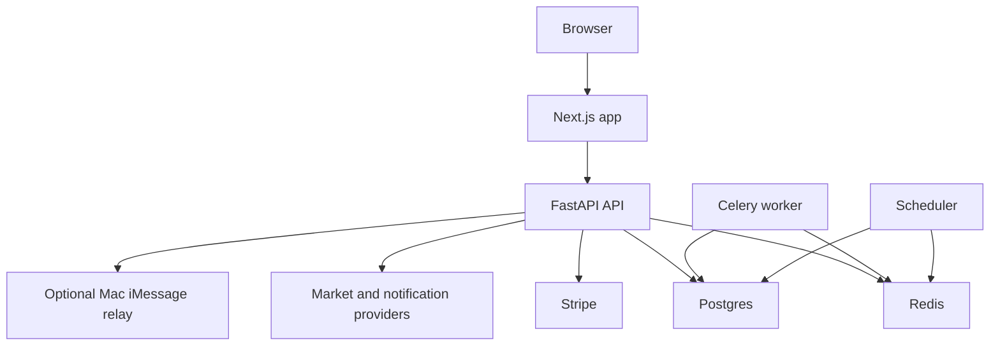

# Deployment Overview

PureGamma AI production deployment has five core runtime groups:

- Web app: Next.js frontend.
- API: FastAPI backend.
- Database: Postgres.
- Queue/cache: Redis.
- Workers: Celery worker and APScheduler process.
- Optional relay: self-hosted macOS iMessage relay.

PureGamma AI is research software. Deployment must preserve disclaimers, source freshness warnings, and safety gates around Portfolio NAV, backtests, and notifications.

## Recommended Topology

## Deployment Units

| Unit | Required | Notes |
| --- | --- | --- |
| Web | Yes | Set `NEXT_PUBLIC_API_URL` to API origin. |
| API | Yes | Needs `DATABASE_URL`, `REDIS_URL`, `JWT_SECRET`, billing mode, and provider env vars. |
| Postgres | Yes | Managed Postgres preferred. |
| Redis | Yes for workers | Required for Celery. |
| Celery worker | Yes for async operations | Uses `packages.workers.tasks`. |
| Scheduler | Yes for daily automation | Runs `python -m packages.workers.scheduler`. |
| iMessage relay | Optional | Must run on macOS for real Messages.app sends. |

## Current Limitations

- No migration framework is present; `Base.metadata.create_all` creates tables at startup. Add Alembic before production schema evolution.
- Portfolio NAV, Plaid, exchange sync, wallet sync, Bloomberg import, and real NautilusTrader runtime are not production-ready.
- Several data provider adapters are placeholders and need provider-specific implementation and monitoring.
- Admin endpoints depend on user `role=admin`; role assignment requires a controlled operational process.

## Release Flow

1. Run tests.
2. Build frontend.
3. Build API image.
4. Apply database migrations once migration tooling is added.
5. Deploy API and workers.
6. Deploy web app.
7. Verify `/health`, auth, Stripe webhooks, report generation, and notification send.
8. Review admin dashboards and observability.

## Related Docs

- [Production Checklist](./PRODUCTION_CHECKLIST.md)
- [Secrets Management](./SECRETS_MANAGEMENT.md)
- [Observability](./OBSERVABILITY.md)
- [Incident Runbook](../admin/INCIDENT_RUNBOOK.md)
