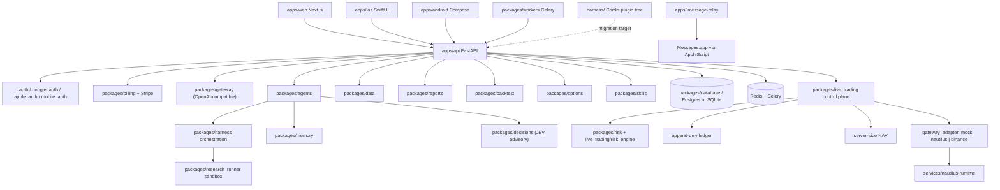

# Architecture

PureGamma AI is organized as a monorepo: application entrypoints in `apps/`,
reusable domain packages in `packages/`, the isolated execution data plane in
`services/`, and the in-progress **PureGamma Harness** plugin workspace in
`harness/`.

PureGamma AI produces research, signals, reports, NAV estimates, backtests, and
gated trading-control surfaces. It does not take custody of assets, and it does
not submit live orders unless every independent gate passes.

Verified against `5d0cdea` (`main` = `refactor/harness-core-v2`).

## Workspace layout

| Root | Contents |
| --- | --- |
| `apps/` | `api` (FastAPI), `web` (Next.js), `ios` (SwiftUI), `android` (Compose), `pocket-relay`, `imessage-relay`, `site` |
| `packages/` | 23 reusable domain packages (see [Backend layers](#backend-layers)) |
| `services/` | `nautilus-runtime` — isolated BACKTEST/PAPER/SHADOW execution data plane |
| `harness/` | PureGamma Harness workspace: Cordis profile overlay, plugin tree, `plugins/catalog.ts` |
| `vendor/` | Git submodules: `deepseek-harness`, `pg-tsy-core-bootstrap` |
| `config/` | Gateway catalog, LLM costs, strategy specs, RSS/FinTwit sources, Stripe plan mapping |
| `deploy/` | Production compose, systemd units, scripts |
| `scripts/` | Ops, migration, verification, iOS release packaging |
| `docs/` | Documentation (see [docs/README.md](../README.md)) |
| `tests/` | pytest unit/integration, Playwright e2e, load and acceptance suites |

## Runtime components

## Backend layers

| Layer | Location | Responsibility |
| --- | --- | --- |
| Routers | `apps/api/routers` (42 modules) | HTTP endpoints |
| Services | `apps/api/services` | Business logic |
| Agents | `packages/agents` | Research, market, risk, strategy, report composition |
| Backtest | `packages/backtest` | Engines, metrics, strategy compiler, agent tools |
| Billing | `packages/billing` | Plans, credit costs, entitlements, metering |
| Capabilities | `packages/capabilities` | Capability status registry |
| Config | `packages/config` | SecretStore, settings helpers |
| Data | `packages/data` | Market, on-chain, RSS, FinTwit, macro providers |
| Database | `packages/database` | SQLAlchemy models, Alembic migrations, seed data |
| Decisions | `packages/decisions` | JEV advisory intent, redaction, rerank, client |
| Gateway | `packages/gateway` | Model catalog, pricing, security, usage metering |
| Harness | `packages/harness` | Deep-research orchestration and security gates |
| Live trading | `packages/live_trading` | Gates, risk engine, control plane, ledger, NAV, kill switches, reconciliation, gateway adapter |
| Memory | `packages/memory` | User memory policy, scopes, proposals, audits |
| Nautilus | `packages/nautilus` | Nautilus data adapter and guardrails |
| Notifications | `packages/notifications` | Channel providers and dispatcher |
| Options | `packages/options` | Chain, surface, Long Gamma scoring |
| Reports | `packages/reports` | Report composition |
| Research runner | `packages/research_runner` | Sandboxed user-code execution |
| Risk | `packages/risk` | Deterministic risk engine |
| Security | `packages/security` | Password hashing and security helpers |
| Skills | `packages/skills` | Skill registry, permissions, deterministic workflows |
| Strategies | `packages/strategies` | Built-in strategy library |
| Trading | `packages/trading` | Order intents, state machines, safety policies |
| Workers | `packages/workers` | Celery tasks and schedules |

## API composition and launch gating

Routers are registered in `apps/api/main.py`. Registration order encodes an
honesty policy that is worth preserving:

- **Always registered, fail honest.** `custody`, `live_trading.trading_router`,
  `live_trading.portfolio_router`, and `mobile` are never conditionally hidden.
  With no provider credentials they report `UNCONFIGURED`; with any LIVE gate
  unmet they report `LIVE_DISABLED`. They never fabricate data.
- **Gated by `INITIAL_LAUNCH_MODE`.** `signals`, `playbooks`, `strategies`, and
  `trading` are registered only when `settings.initial_launch_mode` is false
  (`INITIAL_LAUNCH_MODE`, default `false`). Setting it true removes internal
  research surfaces from the public API rather than hiding them in the UI.

Prefixes that matter: `mobile` → `/api/mobile`, `memory` → `/api/memory`,
`harness_runs` → `/api/research`, `research_runner` → `/api`.

## Request flow examples

**Daily report**

1. `POST /reports/daily`.
2. Auth resolves the current user.
3. Cost control checks the daily report limit.
4. Entitlement check verifies the action is allowed.
5. Credit service consumes report credits.
6. Shared market intelligence is loaded or generated.
7. Signals are scanned.
8. Report writer renders markdown.
9. The report is persisted in `reports`.

**Notification**

1. `POST /notifications/send`.
2. Dispatcher computes or reads the idempotency key.
3. An existing delivery is returned if the key already exists.
4. Recipient and entitlement are checked.
5. Credits are consumed.
6. Provider sends the message.
7. Failed sends refund credits.
8. `notification_deliveries` records the result.

**LIVE order (only when every gate passes)**

Ownership → mandate state → feature gate → user approval → broker health →
whitelist → notional/balance/position/daily-loss/leverage/frequency → kill
switch → idempotency → immutable `RiskCheck` → `OrderIntent` → mandate row lock →
Execution Gateway → `broker_order_id` → fill sync → immutable `LedgerEntry` →
NAV. A submit timeout becomes `UNKNOWN` and is queried, never blindly retried.

## Persistence

Alembic migrations live in `packages/database/alembic/versions`. There are 33
migration files; the current head is `0032_chat_workspace`. Migration-chain
integrity is covered by `tests/security/test_migration_chain.py`.

## Data flow

Data adapters live in `packages/data`. Mock data is the default in development.
Production providers add retries, source freshness, rate limits, and
observability, and normalized records carry provenance, license status, and
retention policy.

## PureGamma Harness refactor

`harness/` is the migration target: PureGamma is being rebuilt as a DeepSeek
Harness profile powered by Cordis, where business capabilities become plugins
rather than a privileged application core. The plugin tree currently holds 58
plugin directories with the machine-readable source of truth in
`harness/plugins/catalog.ts`.

See [HARNESS_CORE_V2.md](../architecture/HARNESS_CORE_V2.md) for the
architectural decision, migration slices, and the per-capability migration gate.

## Known architecture gaps

Verified against `5d0cdea`:

- **No tenant/workspace model.** There is no `tenant_id` in
  `packages/database/models.py`; isolation is per-user only. See
  [Tenant Isolation](../security/TENANT_ISOLATION.md).
- **No Redis Streams event pipeline or DLQ.** Raw/normalized/enriched/feature
  events with checkpoints and a dead-letter queue are contracted but not built.
- **Bloomberg import is contract-only** — an enterprise import path, not a
  working provider.
- **LIVE broker adapter is not provisioned by default.**
  `LIVE_TRADING_GATEWAY` defaults to `mock`; `nautilus` and `binance` exist as
  code paths (`binance` requires `LIVE_TRADING_PROVIDER=binance_spot`) but no
  production broker connection is approved.
- **App Store / Play release is pending** for the iOS and Android apps.
- **Harness migration is incomplete.** Legacy FastAPI routers remain the serving
  path; see the migration sequence in
  [HARNESS_CORE_V2.md](../architecture/HARNESS_CORE_V2.md).

## Related documentation

- [Documentation index](../README.md)
- [Target Architecture](../review/TARGET_ARCHITECTURE.md)
- [Harness Core V2](../architecture/HARNESS_CORE_V2.md)
- [API Reference](./API_REFERENCE.md)
- [Database Schema](./DATABASE_SCHEMA.md)
- [LIVE trading architecture](../live-trading/ARCHITECTURE.md)
- [Production Checklist](../deployment/PRODUCTION_CHECKLIST.md)
