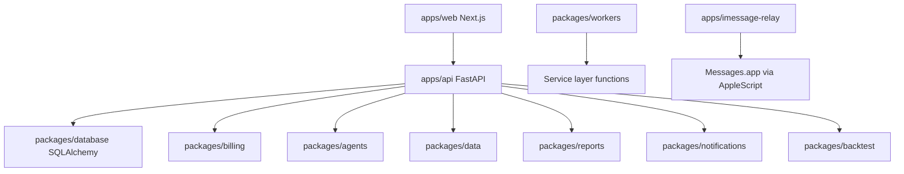

# Architecture

PureGamma AI is organized as a monorepo with application entrypoints in `apps/` and reusable domain packages in `packages/`.

PureGamma AI produces research, signals, reports, NAV estimates, and backtests only. It does not place trades or guarantee returns.

## Runtime Components

## Backend Layers

| Layer | Location | Responsibility |
| --- | --- | --- |
| Routers | `apps/api/routers` | HTTP endpoints |
| Services | `apps/api/services` | Business logic |
| Database | `packages/database` | Models, session, seed data |
| Billing | `packages/billing` | Plans, credit costs, entitlements |
| Agents | `packages/agents` | Research, market, risk, strategy, report composition |
| Data | `packages/data` | Market and source providers |
| Notifications | `packages/notifications` | Channel providers and dispatcher |
| Workers | `packages/workers` | Celery tasks and schedules |

## Request Flow Example

Daily report:

1. `POST /reports/daily`.
2. Auth resolves current user.
3. Cost control checks daily report limit.
4. Entitlement check verifies action allowed.
5. Credit service consumes report credits.
6. Shared market intelligence is loaded or generated.
7. Signals are scanned.
8. Report writer renders markdown.
9. Report is saved in `reports`.

## Notification Flow Example

1. `POST /notifications/send`.
2. Dispatcher computes or reads idempotency key.
3. Existing delivery is returned if key already exists.
4. Recipient and entitlement are checked.
5. Credits are consumed.
6. Provider sends message.
7. Failed sends refund credits.
8. `notification_deliveries` records the result.

## Data Flow

Current data flow is mock-first:

- `MockMarketDataProvider` returns deterministic asset data.
- Placeholder provider classes keep interfaces stable.
- `SharedMarketIntelligence` stores reusable market summaries.
- `Signal` and `Report` records persist derived research.

Production provider implementations should add retries, source freshness, rate limits, and observability.

## Known Architecture Gaps

- No Alembic migrations yet.
- No backend portfolio account, holding, transaction, or NAV tables yet.
- No Plaid, exchange account, or wallet sync routers yet.
- No real NautilusTrader runtime yet.
- No tenant/workspace model yet.
- No durable dead-letter queue yet.

See [Production Checklist](../deployment/PRODUCTION_CHECKLIST.md).
