# Automated Trading Foundation

> Status: Phase 1 (data model + audits only) · Flags: `AUTO_TRADING_MANDATES_ENABLED`,
> `AUTO_TRADING_PAPER_ENABLED`, `AUTO_TRADING_SHADOW_ENABLED`,
> `AUTO_TRADING_LIVE_ENABLED` — all default `false`.
> **LIVE auto trading is not implemented, not enabled, and has no code path.**

## 1. Roles

```mermaid
flowchart LR
  D["Market data / events (existing)"] --> F["Deterministic feature calculation"]
  F --> S["Deterministic SignalEvent (existing table)"]
  S --> M["TradingMandate policy checks (new)"]
  M --> R1["PureGamma pre-trade risk (existing)"]
  R1 --> R2["Nautilus independent risk (existing)"]
  R2 --> A["PAPER or SHADOW action only"]
  A --> J["Execution journal / reconciliation (existing)"]
  J --> P["Post-trade ResearchArtifact / notification (new, optional)"]
```

- **Harness = researcher**: proposes strategy drafts, runs backtests and
  sensitivity analysis, explains Shadow/Paper results, suggests pauses.
- **PureGamma deterministic policy = the only decision gate.**
- **Nautilus Runtime = the only executor** (BACKTEST/PAPER/SHADOW; LIVE
  disabled — `NAUTILUS_LIVE_TRADING_ENABLED=false`,
  `NAUTILUS_ALLOW_LIVE_ORDER=false`, `NAUTILUS_ALLOW_WITHDRAWAL=false`,
  `NAUTILUS_ALLOW_TRANSFER=false` unchanged).

## 2. TradingMandate

`trading_mandates` (new table) is the user's explicit, audited authorization
envelope:

- references an **immutable reviewed `StrategyRelease`** (never Harness
  natural language or drafts);
- pins account, asset allowlist, allowed side, max total/per-order/position
  notional, max leverage, max daily loss, max trades/day, max order
  frequency, allowed time windows, data freshness requirement, source policy,
  stop conditions, kill-switch state. **Risk thresholds are stored as
  `Numeric(20, 8)` — never binary floating point.**
- is created via explicit user choice + full parameter display + dual
  confirmation with an exact confirmation phrase + cooldown + expiry +
  revocable at any time;
- every execution/rejection/pause/resume/reconciliation event carries
  idempotency key, trace ID, mandate ID, strategy version, signal ID and an
  audit row (`trading_mandate_audits`).

## 3. Four-layer gate (fail closed)

1. **Data freshness/integrity** — signal data must satisfy the mandate's
   freshness and source policy.
2. **TradingMandate policy** — asset/side/notional/leverage/frequency/time
   window/daily loss checks.
3. **PureGamma pre-trade risk** — existing `packages/trading` policy and
   preview/confirm machinery (never bypassed).
4. **Nautilus independent risk** — existing runtime risk gateway.

Any failure rejects the action (fail closed) and writes an audit row.
**Auto-pause is automatic; resume always requires explicit human
confirmation.** Harness can only suggest a pause — it cannot lift one, touch
the kill switch, or modify risk limits.

## 4. Shadow fidelity

Shadow runs record expected price, market touchable price, actual simulated
fill price, slippage, latency, rejection reasons, and reconciliation
outcome. Paper runs follow the same path with mock/testnet execution.

## 5. Staged rollout (all gates must hold before the next stage)

1. **Backtest** — Harness orchestrates research and backtests only.
2. **Shadow** — production data, recorded "would-have" orders, no real orders.
3. **Paper** — mock/testnet automatic execution.
4. **Limited LIVE** — NOT in scope; would require legal, account-safety,
   risk, rollback, human-on-call, plus deployment/admin/user/account/strategy
   level explicit switches. In Phase 1
   `Settings.auto_trading_live_effective` in `apps/api/config.py` is
   **hard-coded `False`** — even with every environment flag set there is no
   LIVE path; Phase 4 reopens it only after all gates exist.
5. **Scale** — long-running evidence, incident drills, model evaluation,
   monitoring and audit.

## 6. Non-negotiable boundaries

Harness output can never be an order trigger; only deterministic
`SignalEvent`s may drive the pipeline. Harness cannot create/approve
strategies or mandates, choose real capital sizes, send orders, change risk
limits, lift kill switches, or bypass preview/confirmation/audit. Memory is
never a trading or risk input (see
[MEMORY_ARCHITECTURE](./MEMORY_ARCHITECTURE.md)).
