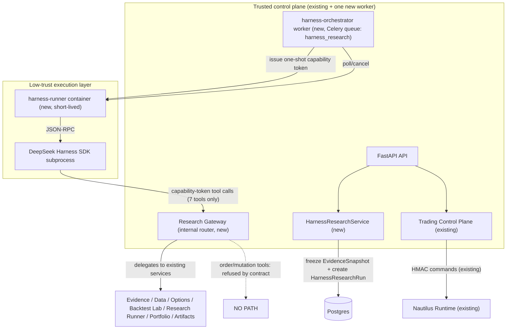

# Harness Research Architecture

> Status: Phase 1 (foundation) · Feature flag: `HARNESS_RESEARCH_ENABLED` (default `false`)
> Scope: additive. Existing Agent Chat, Skills, Credits/Stripe, data pipeline,
> daily reports, notifications, Research Runner, Backtest Lab, Options,
> Portfolio Autopilot, Trading Control Plane and Nautilus Runtime behavior are
> unchanged.

DeepSeek Harness is a **research orchestration engine**, never an execution
engine. It plans multi-step research, coordinates sub-agents (macro /
on-chain / options / risk), recovers long-running sessions, and returns a
server-validated `ResearchArtifact`. Orders are produced exclusively by the
existing `Trading Control Plane -> Nautilus Runtime` path.

## 1. Trust topology (two-layer split)

The Celery worker needs Redis/DB; the low-trust runner must not. They are
therefore **two separate layers**:

| Layer | DB | Redis | Docker socket | .env | Nautilus net | Network |
|---|---|---|---|---|---|---|
| harness-orchestrator worker | yes | yes (broker) | no | yes (control-plane) | no | egress only |
| harness-runner container | no | no | no | no | no | off by default |
| Research Gateway | yes | no | no | control-plane | no | internal |

## 2. Runner isolation contract

- Non-root (`uid 10001`); `read_only: true` root filesystem;
  `security_opt: [no-new-privileges:true]`; `cap_drop: [ALL]`.
- No docker socket, no production `.env`, no DB/Redis/Nautilus endpoints, no
  host paths, no long-lived credentials.
- Network disabled by default (`HARNESS_RESEARCH_NETWORK_ENABLED=false`).
- `mem_limit` / `cpus` / `pids_limit` / disk and `timeout` caps
  (`HARNESS_RUN_TIMEOUT_SECONDS`, default 720s).
- **Writable scratch only**: root fs is read-only, but `session_root`,
  `workspace`, and `artifact_staging` are short-lived `tmpfs`/ephemeral
  volumes so the Harness JSONL session can persist for recovery. They are
  destroyed at run end and are never host-visible.
- Pinned `deepseek-harness-sdk` + `runtime-bin` versions, Cordis config hash,
  and plugin lock hash are recorded on every run (see
  `packages/harness/versions.py`).
- Minimal Cordis composition (`packages/harness/composition.py`): JSON-RPC
  server + `research_gateway_client` only. `bash` / `filesystem` / `editor` /
  URL tools / `danger-full-access` are disabled. No `npx`, `pnpm install`,
  `pip install`, or dynamic plugin downloads.

## 3. Research Gateway (the only I/O channel)

Every runner call uses a **one-shot capability token** bound to:
`run_id`, `user_id`, fixed Skill version, tool allowlist, explicit expiry,
max call count and credit budget. Tokens cannot escalate, cannot cross runs
or users, and carry no long-term secrets.

Phase-1 tools (each delegates to an existing audited service):

| Tool | Delegates to | Constraint |
|---|---|---|
| `get_evidence_snapshot` | EvidenceSnapshot store | only this run's frozen snapshot |
| `get_market_series` | archived market data | symbol/timeframe/scope/source + row caps |
| `get_options_context` | `options_service.py` | read-only results |
| `run_backtest` | Backtest Lab | approved strategy specs only; returns artifact ref |
| `run_research_code` | Research Runner sandbox | no-network, resource-limited, AST-validated |
| `get_portfolio_snapshot` | `portfolio_service.py` | portfolio Skill authorized, sanitized, freshness-flagged |
| `save_research_artifact` | artifact validator | schema-validated before persistence |

Denied, hard-coded (see `packages/harness/security.py`): shell, filesystem,
editor, URL fetch, browser, arbitrary SQL/GraphQL/RPC, env/secret reads,
Docker, process spawn, orders, strategy/risk/mandate mutation, kill switch,
account connect, withdraw/transfer, payment, direct messaging.

## 4. Domain model and state machine

New tables (migration `0025_harness_research`, revises
`0024_portfolio_nav_snapshots`): `harness_research_runs`,
`harness_run_state_transitions`, `evidence_snapshots`, `research_artifacts`,
`strategy_releases`, `trading_mandates`, `trading_mandate_audits`,
`harness_event_outbox`.

`HarnessResearchRun` states: `queued -> preparing -> running -> validating ->
completed | degraded | failed | canceled | timed_out`. Transitions are
idempotent, audited, and guarded by a **conditional UPDATE**
(`WHERE status = expected`) so concurrent workers can only ever apply one
effective transition (`packages/harness/state_machine.py`). Cancel
terminates the runner and settles/refunds via the existing credit service.

`EvidenceSnapshot` and `StrategyRelease` immutability is enforced, not just
documented: SQLAlchemy events reject updates (and deletes, for snapshots);
a StrategyRelease may only change its review fields. Snapshot deduplication
uses two PARTIAL unique indexes so NULL-owner shared snapshots cannot
duplicate: `(content_hash, source_scope) WHERE user_id IS NULL` and
`(content_hash, source_scope, user_id) WHERE user_id IS NOT NULL`.

## 5. Billing model

Existing credit flow is reused unchanged:
`quote_task -> reserve_task -> (run) -> settle_task / refund_task`.
The run records `max_budget_credits` at quote time; the orchestrator stops
the runner when the budget is exhausted and settles only actual usage.
Retries reuse the same idempotency key; refunds are idempotent.

## 6. Capacity control (80–200 users)

- `HARNESS_GLOBAL_CONCURRENCY=2`; max 1 concurrent run per user;
  `HARNESS_MAX_RUNS_PER_USER_PER_DAY=3`.
- Queue with priority + cancel; `queue_wait`, duration, tool count, tokens,
  failure category, artifact validation result and refund status are recorded
  and observable per run.
- Agent Chat P95 is unaffected: Harness runs on a dedicated Celery queue.
- Events use a DB outbox (`harness_event_outbox`) with idempotency keys;
  Redis Streams is a later evolution, not a Phase-1 blocker.

## 7. Memory boundary

Harness does not own user memory. Every run gets a fresh session ID; Harness
JSONL sessions exist only for short-term recovery with a short TTL. Harness
receives only API-provided short-term summaries and permission-filtered
medium-term memory, and its output can only produce `memory_proposals`
(validated by the PureGamma Memory Policy). Memory is never trading
authorization or risk input. See
[Memory Architecture](./MEMORY_ARCHITECTURE.md).

## 8. Data pipeline integration

Existing pipeline remains the sole fact producer:
`provider sync -> normalize -> enrich -> market events/features ->
EvidenceSnapshot -> Harness -> ResearchArtifact -> UI / notification`.
Harness never scrapes Binance/RSS/X/on-chain/Bloomberg.

## 9. Rollout

1. Phase 1 (this): docs, models, migration, feature flags, mock adapter,
   Memory Service, tests.
2. Phase 2: harness-runner image, minimal Cordis composition, Research
   Gateway, capability tokens.
3. Phase 3: `harness_deep_research` Skill wiring, Agent Chat additive SSE
   events (`harness.queued/started/progress/completed/failed`), artifact UI,
   settlement/refund closure.
4. Phase 4: TradingMandate model + PAPER/SHADOW policy enforcement.
5. Phase 5: notifications (new event types, default off), observability,
   Runbooks.

LIVE auto trading is not implemented and cannot be enabled by environment
variables alone (deployment + admin + user + account + strategy gates would
all be required; `auto_trading_live_effective` encodes this).
