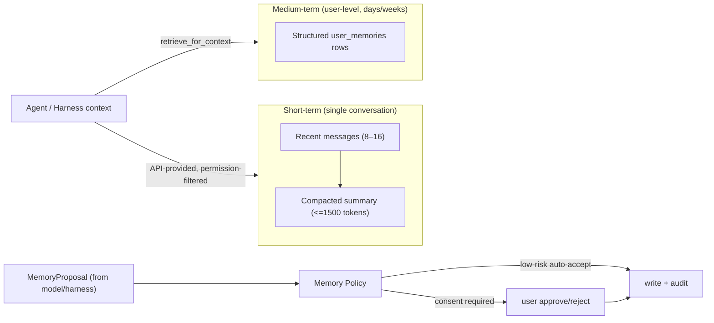

# Memory Architecture

> Status: Phase 1 · Flag: `MEMORY_SERVICE_ENABLED` (default `false`)
> Memory is owned by PureGamma. Models and Harness NEVER write memory
> directly, and memory is NEVER trading authorization or risk input.

## 1. Two layers



- Short-term: recent message window + bounded summary; scoped to one
  `conversation_id`; contains goals, known facts, used evidence, open
  questions, explicit user preferences only. Secrets, payment data, private
  keys, account tokens and unverified market conclusions are rejected or
  redacted. Summaries carry `source_message_ids`, `version`, `created_at`,
  `expires_at`, and are cascade-deleted with the conversation. Default TTL
  30 days (`MEMORY_SUMMARY_TTL_DAYS`).
- Medium-term: structured `user_memories` rows in Postgres. No vector
  database in Phase 1 (pgvector is only considered if retrieval quality
  proves insufficient).

## 2. Namespaces (strongly isolated)

| Namespace | Purpose | Write policy |
|---|---|---|
| `chat` | language/display preferences | auto for low-risk deterministic kinds |
| `secretary` | todos, appointments, follow-ups | user consent |
| `research` | watchlist, topics, confirmed hypotheses, unfinished tasks | consent / low-risk auto |
| `portfolio` | only user-allowed preferences | consent |
| `trading` | — | **writes rejected by policy** |

## 3. Write path (models can never write directly)

```
MemoryProposal (model | harness | deterministic | user)
  -> MemoryPolicy: namespace, sensitivity, source, TTL, dedupe, secret scan
  -> user confirmation OR low-risk auto-accept
  -> immutable MemoryAuditRecord
  -> structured UserMemory write
```

`packages/memory/policy.py` implements the decision matrix and a
secret-pattern scanner (API keys, private keys, bearer tokens, connection
strings, long account numbers, key material) that force-rejects proposals.
`packages/memory/service.py` is the only sanctioned writer.

## 4. Retrieval

`retrieve_for_context` returns only active, unexpired, user-authorized,
consent-scope-matched entries — a small, salience-ordered window (default
limit 8). **The `MemoryScopeSetting` check is non-bypassable: the method
has no parameter to skip it**, and `list_memories` (user-facing settings
UI) is documented to never feed model context. Conversation summaries
require verified conversation ownership (`save_conversation_summary` /
`active_conversation_summary` both check `user_id` against
`agent_conversations`). **All structured summary fields (`goals`,
`known_facts`, `used_evidence`, `open_questions`, `user_preferences`) are
recursively secret-scanned and redacted, truncated, and capped; message-id
arrays are length/count capped.** Proposal and memory expiry use the exact
TTL decided by the Memory Policy (`decision.ttl_seconds`), never a generic
default. Retrieval updates `last_used_at` and writes a read audit record.
Memory content is treated as **untrusted context**: it cannot override
system policy, Skill permissions, Evidence Packs, risk or trading
boundaries.

## 5. User controls

Users can view their medium-term memory, edit/delete single entries, clear a
namespace, disable a scope (`memory_scope_settings`), and export everything
(with audit records).

## 6. Harness boundary

- Each Harness run uses an independent session ID; no cross-run/cross-user
  Harness session reuse.
- Harness JSONL session logs exist only for short-term recovery and are
  deleted after a short TTL.
- Harness receives only API-provided summaries and permission-filtered
  memory; it cannot enumerate or search full conversation history.
- Harness output can only generate `memory_proposals`, never direct writes.

## 7. Retention defaults

| Kind | Auto-write | TTL |
|---|---|---|
| conversation summary | yes | conversation deletion or 30 days |
| language/display preference | yes (editable) | long-lived |
| watchlist | user confirm | long-lived |
| unfinished research task | yes | 30 days |
| deep-research conclusion summary | confirm / low-risk auto | 14–90 days (default 30) |
| secretary todo | user confirm | delete on completion |
| trading-* | never | — |

See also [MEMORY_PRIVACY_AND_RETENTION](../security/MEMORY_PRIVACY_AND_RETENTION.md).
