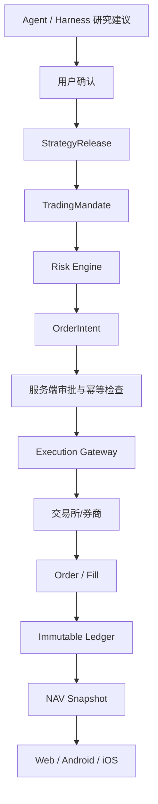

# LIVE Trading + NAV — 架构文档

> 版本 1.0 · 单服务器、低复杂度、可审计、可暂停。不引入 Kubernetes / Kafka /
> Elasticsearch / 微服务集群。

## 1. 目标

在现有 PureGamma.ai( FastAPI + PostgreSQL + Redis + Celery + Nautilus
Runtime/Execution Gateway)之上,以**新增能力**实现受控 LIVE 现货交易:

- 30–200 订阅用户、单台 16GB 服务器;
- 一个交易所/券商、现货、白名单资产、小额资金;
- 禁提现、禁转账、禁杠杆、禁期货、禁期权、禁做空、禁跨账户。

## 2. 逻辑流程

Harness 只能生成研究结论和策略建议,不得直接调用交易所接口,不得直接生成
交易订单。所有订单必须经过 **Trading Control Plane**
(`packages/live_trading/control_plane.py`)。

## 3. 组件

| 组件 | 位置 | 职责 |
| --- | --- | --- |
| Trading Control Plane | `packages/live_trading/control_plane.py` | 唯一可以提交 LIVE 订单的组件(23 步顺序执行) |
| Risk Engine | `packages/live_trading/risk_engine.py` | 14 类下单前检查,全 Decimal,版本化 |
| Immutable Ledger | `packages/live_trading/ledger.py` + `LedgerEntry` | 只追加;ORM 事件拒绝 UPDATE/DELETE |
| NAV Calculator | `packages/live_trading/nav.py` | 服务器计算 NAV = 现金 + Σ(数量 × 最新有效价) |
| Kill Switch | `packages/live_trading/kill_switch.py` | global / user / mandate / connection 四级 |
| 对账 | `packages/live_trading/reconciliation.py` | 每日:交易所余额 vs Ledger vs NAV |
| Secret Store | `packages/live_trading/secret_store.py` | Fernet 密文/KMS 引用;数据库无明文 |
| Feature Gate | `packages/live_trading/flags.py` | 多条件门;任一不满足 → LIVE_DISABLED |
| Execution Gateway 适配层 | `packages/live_trading/gateway_adapter.py` | nautilus 适配 + 诚实 mock + 网关工厂 |
| 真实执行网关(Binance 现货) | `packages/live_trading/binance_spot_gateway.py` | `LIVE_TRADING_GATEWAY=binance` 时启用:签名下单/撤单/查询/余额/持仓/行情;超时→UNKNOWN 只查询不重试;API Key 权限硬校验(提现/转账/杠杆/合约/期权→拒绝) |
| 行情记录 | `packages/live_trading/price_feed.py` | 服务器时间戳,读取时判 stale |
| 审计 | `packages/live_trading/audit.py` | 每笔请求 trace_id + append-only 审计 |

## 4. 数据表(migration `0026_live_trading_control_plane`)

`broker_connections`、`live_user_approvals`、`trading_kill_switches`、
`market_price_snapshots`、`live_order_intents`、`risk_checks`、
`live_orders`、`fills`、`ledger_entries`、`nav_snapshots`、
`trading_reconciliations`;`trading_mandates` 扩展
(`allowed_symbols_json`、`approval_status`、`environment`、`status`、
`approved_by`、`broker_connection_id`);`trading_audit_logs` 增加 `trace_id`。

金额/风控字段一律 `Numeric(20,8)`,无 Float。

## 5. 订单执行安全(23 步)

Control Plane 严格顺序:所有权 → Mandate 状态 → LIVE Feature Flag →
用户资格审批 → 连接健康 → 白名单 → 数量/价格/金额 → 余额 →
单笔上限 → 总持仓 → 日亏损 → 杠杆 → 频率 → Kill Switch → 幂等键 →
写入 RiskCheck(不可篡改) → 写入 OrderIntent → Mandate 行锁事务 →
提交 Execution Gateway → 保存 broker_order_id → 后台同步成交 →
写入 Fill + Ledger → 重算 NAV。

**第 19 步之前任何失败都不会触碰真实订单。** 提交超时 → 状态 UNKNOWN,
只查询不盲目重试;客户端时间从不被信任;所有请求生成 trace_id。

## 6. 并发与幂等

- 每个订单唯一 `idempotency_key`;重复请求返回原订单;
- Mandate 使用 `SELECT ... FOR UPDATE` 行锁,不允许并发修改;
- 同一 Mandate 的 pause/resume/submit 全部串行化;
- `live_order_intents` / `live_orders` / `ledger_entries` 唯一约束兜底。

## 7. 后台任务(单服务器预算)

| 任务 | 间隔 |
| --- | --- |
| `puregamma.refresh_live_market_prices` | 5–15s |
| `puregamma.sync_live_order_statuses` | 5–10s |
| `puregamma.sync_live_balances_and_positions` | 30–60s |
| `puregamma.calc_nav_for_active_accounts` | 30–60s |
| `puregamma.daily_live_reconciliation` | 每日 |
| `puregamma.calc_nav_for_account` | 成交后触发 |

Celery worker 并发 ≤ 2;Harness 全局并发 1–2;单用户研究任务并发 1。
